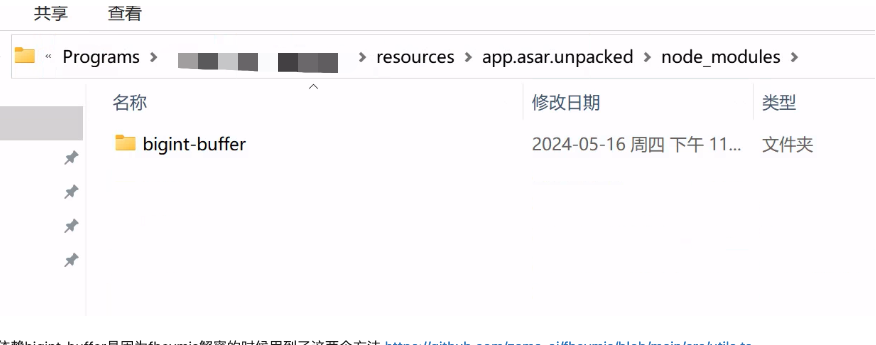

## vite-vue2

## 解决问题：

1. gm-crypto electron 打包后报 Buffer 的错误

## 备忘录

1. package.json 暂时不需要 key：browserslist
   package.json 简化版
   `{"name": "vite-vue2","browserslist": [ "defaults"]}`

- browserslist:在不同的前端工具之间共用目标浏览器和 node 版本的配置工具
- 主要被以下工具使用：
  - Autoprefixer
  - Babel
  - post-preset-env
  - eslint-plugin-compat
  - stylelint-unsupported-browser-features
  - postcss-normalize
- 用途：
  在创建前端工程的时候，一个比较好的做法是制定你的工程上线之后主要支持的浏览器版本，在你支持的浏览器版本里面，你的项目运行没问题，不在范围的浏览器可能会出现一些高级 JS，css 特性不支持的 bug。哪些新的 ES6+的特性保留原样，哪些特性要转译成 es5，webpack，babel 本身是通过这个工具提供的浏览器支持范围来确定的

2. jsconfig.json 文件

- Vetur 插件会读取

3. npm 常用参数

- -P(--save-prod)：dependencies 依赖项安装，不指定-D 或-O 时，默认使用此项
- -D(--save-dev)：devDependence 开发依赖项安装
- -O(--save-optional)：optionalDependencies 可选依赖项安装
- -g(--global)：全局安装
- -B(--save-bundle)： bundleDependencies 依赖项安装
- -E(--save-exact)：明确版本号安装，使用^符号进行默认安装。
- -w(--workspace)： install 命令也是支持多工作区安装的
- -ws(--workspaces)：设置为 false 时，禁用 workspaces

4. 发布的打包版本仍有多余的 app.asar.unpacked 目录
   
   依赖 bigint-buffer 是因为 fhevmjs 解密的时候用到了这两个方法 https://github.com/zama-ai/fhevmjs/blob/main/src/utils.ts
   `import { toBigIntBE, toBufferBE } from 'bigint-buffer';`
   而检查 bigint-buffer 中这两个方法的实现：https://github.com/no2chem/bigint-buffer/blob/master/src/index.ts

   ```export function toBigIntBE(buf: Buffer): bigint {
   if (process.browser || converter === undefined) {
     const hex = buf.toString('hex');
     if (hex.length === 0) {
       return BigInt(0);
     }
     return BigInt(`0x${hex}`);
   }
   return converter.toBigInt(buf, true);
   }
   ```

   只有在 node.js 环境中运行的时候才会使用 C 语言写的 native 版本，在浏览器中执行时会回落到纯 js 的实现，而我们用到 fhevm.js 加解密都是在浏览器中执行的。因此不需要 native 的版本

- 禁止编译 native 的 node_modules
  - package.json key build 增加 "npmRebuild": "false",
  - 手动打包没有了 app.asar.unpacked, 但是自动构建发布的版本还是有, 可能与 USE_HARD_LINKS 有关
  - 因为禁用了 npm 的 rebuild，不再需要使用 USE_HARD_LINKS
- 禁用 smartUnpack 同时不需要设置 USE_HARD_LINKS(本项目打包构建过程没有出现错误，客户端错误使用其修复)
  ```
     "asar": true,
  ```
  改为
  ```
   "asar": {
      "smartUnpack": false
    },
  ```

5. src/app.vue 重命名 src/App.vue

- git 大小写不敏感
- 执行 git config --global core.ignorecase false，全局设置 大小写敏感
- 直接使用以下命令重命名文件
- git mv -f src/app.vue src/App.vue

6. vitest

- npm install -D vitest
- npm i -D happy-dom
- npm i -D @vitest/coverage-v8
- npm i -D @vitest/ui

7. 测试覆盖率

- 代码覆盖率是一种用于评估代码的质量和完整性的指标，它表示代码中有多少比例被测试用例所覆盖。测试覆盖率的工具可以帮助开发者生成和查看覆盖率报告，从而发现代码中的潜在问题和改进点。
  package.json 中添加以下代码：

  ```
  　"scripts": {
  　　    "coverage": "vitest run --coverage"
  　　  },
  ```

- npm run test-ui 命令输出错误可改用 npx vite preview --outDir html 打开 test UI 页面
